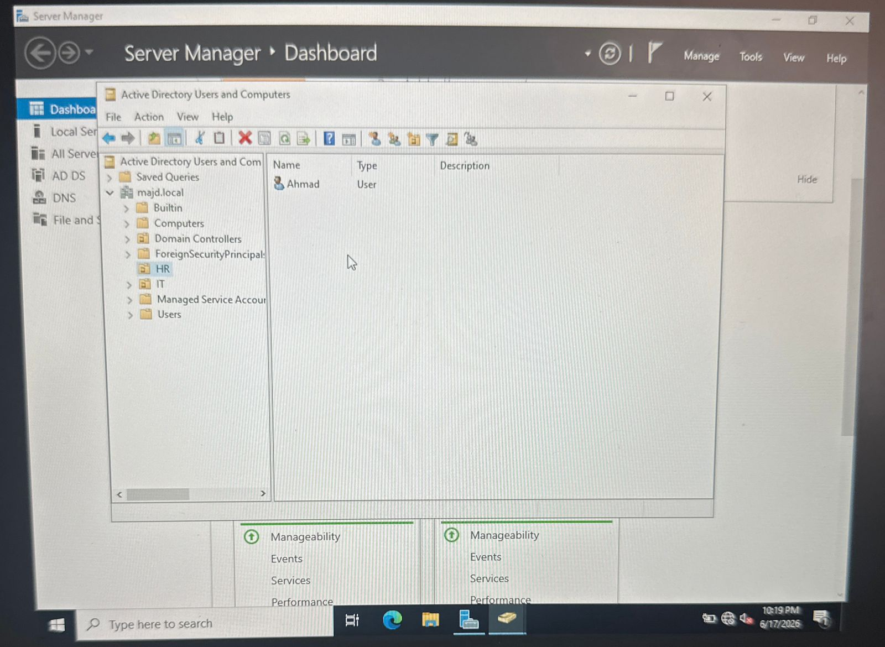
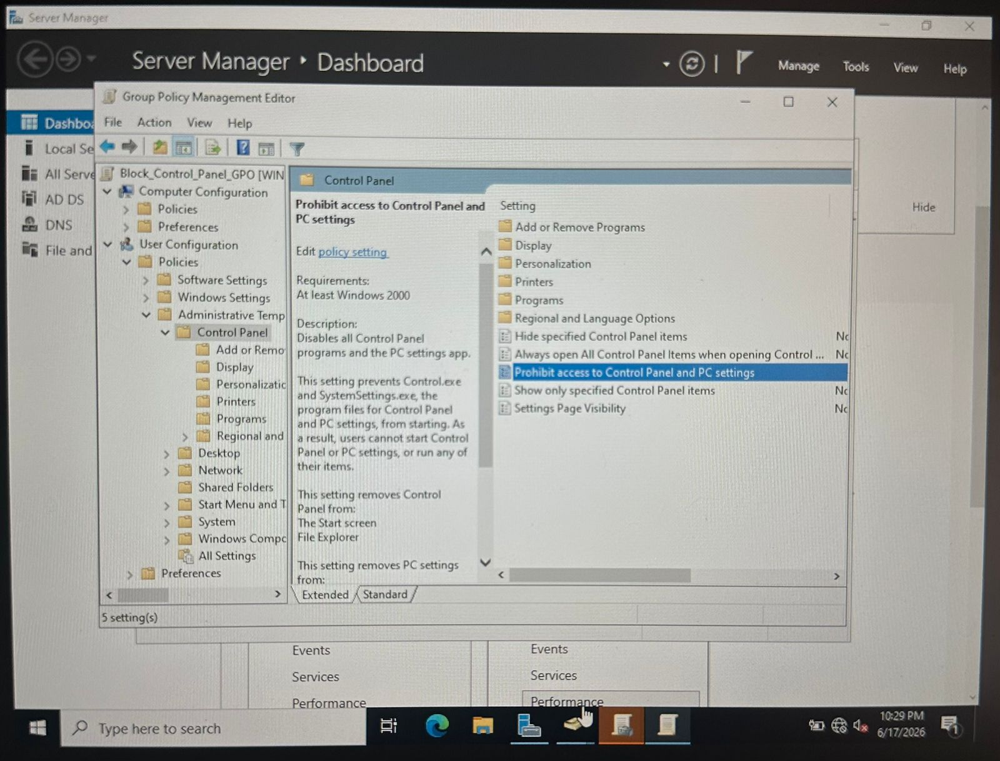
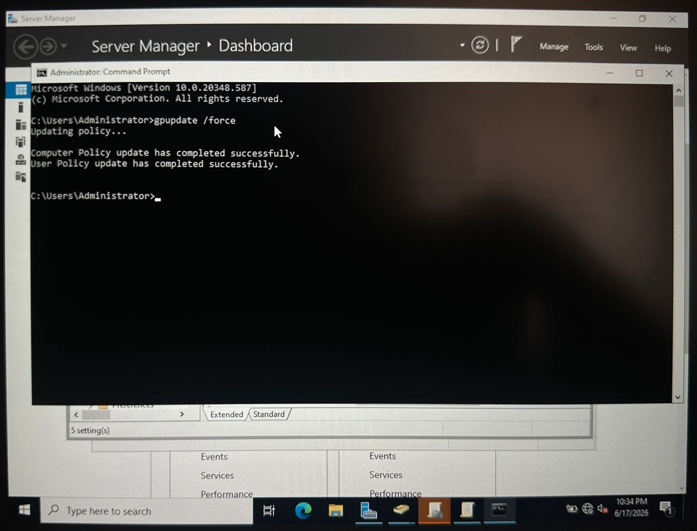

 ## Verification & Key Artifacts

### 1. Active Directory Identity Hierarchy (IAM Blueprint)

*Evidence of structured OU engineering, showcasing administrative container separation and domain account provisioning.*

### 2. GPO Hardening Rule Configuration

*Technical proof showing the specific administrative template configuration utilized to restrict system-level changes on endpoints.*

### 3. Server Promotion & Domain Access Control

*Active administration session verifying successful domain forest registration and secure administrator privileges.*

### 4. Group Policy Security Propagation

*Command-line validation showing execution of policy synchronization, confirming the endpoint infrastructure has successfully received and applied the hardening rules.*
