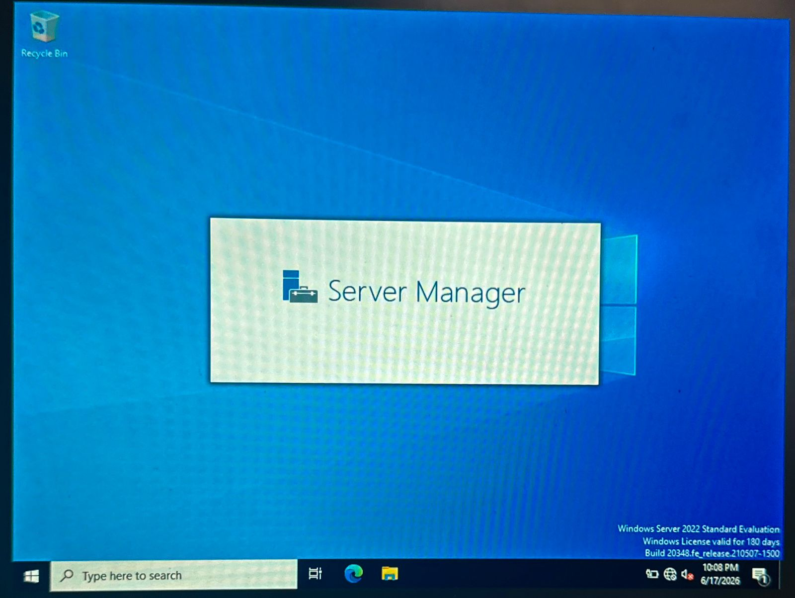

# Windows Server 2022: Active Directory & IAM Security Hardening Lab

## Project Overview
This project demonstrates the deployment, configuration, and security hardening of an enterprise Identity and Access Management (IAM) infrastructure using **Windows Server 2022** inside a virtualized environment (**Oracle VirtualBox**). 

The primary objective was to architect a production-ready **Active Directory Domain Services (AD DS)** environment, implement a secure administrative hierarchy, and enforce system-level security restrictions using **Group Policy Objects (GPOs)** based on the Principle of Least Privilege (PoLP).

---

## Technical Specifications & Topology
* **Hypervisor:** Oracle VirtualBox
* **Operating System:** Windows Server 2022 Datacenter (Evaluation Edition)
* **Domain Name:** `cyberlab.local`
* **Core Services:** Active Directory Domain Services (AD DS), DNS, Group Policy Management

---

## Architecture & Implementation Steps

### 1. Active Directory Installation & Domain Promotion
* Configured static IP addressing and internal network settings to isolate the environment.
* Installed the AD DS role via Server Manager and promoted the server to a **Domain Controller (DC)**, establishing the root domain forest.

### 2. Identity & Access Management (IAM) Hierarchy Design
* Designed and engineered a structured **Organizational Unit (OU)** tree to separate administrative boundaries, departments, and assets.
* Provisioned standard domain user accounts (e.g., `Ahmad`) within designated functional OUs to test policy propagation.
* Applied **Role-Based Access Control (RBAC)** to ensure users only have access to resources required for their explicit operational roles.

### 3. Group Policy Security Hardening
* Created and linked custom **Group Policy Objects (GPOs)** to enforce specific baseline security controls across endpoints.
* **Applied Rule:** *Prohibit access to Control Panel and PC settings* to reduce the system's attack surface and prevent unauthorized configuration changes by non-administrative users.
* Validated policy enforcement on target organizational containers using command-line administrative utilities.

---

## Verification & Key Artifacts

### 1. شاشة تسجيل دخول المسؤول بالنطاق (Domain Administrator Login)

*Active administration session verifying successful domain forest registration and secure administrator privileges under the domain context.*

### 2. واجهة مدير الخادم وبداية التهيئة (Server Manager Dashboard)

*Initial Server Manager environment execution, establishing the core management baseline for the secure server infrastructure.*

### 3. تسلسل هوية Active Directory (مخطط IAM للأقسام والمستخدمين)

*Evidence of structured OU engineering, showcasing administrative container separation and domain account provisioning (e.g., Ahmad).*

### 4. تكوين قواعد تقوية GPO (حظر لوحة التحكم)

*Technical proof showing the specific administrative template configuration utilized to restrict system-level changes on endpoints.*

### 5. نشر سياسة المجموعات بنجاح عبر الكوماند (GPO Enforcement via CMD)

*Command-line validation showing successful execution of the policy update via 'gpupdate /force', confirming the infrastructure received the hardening rules.*
